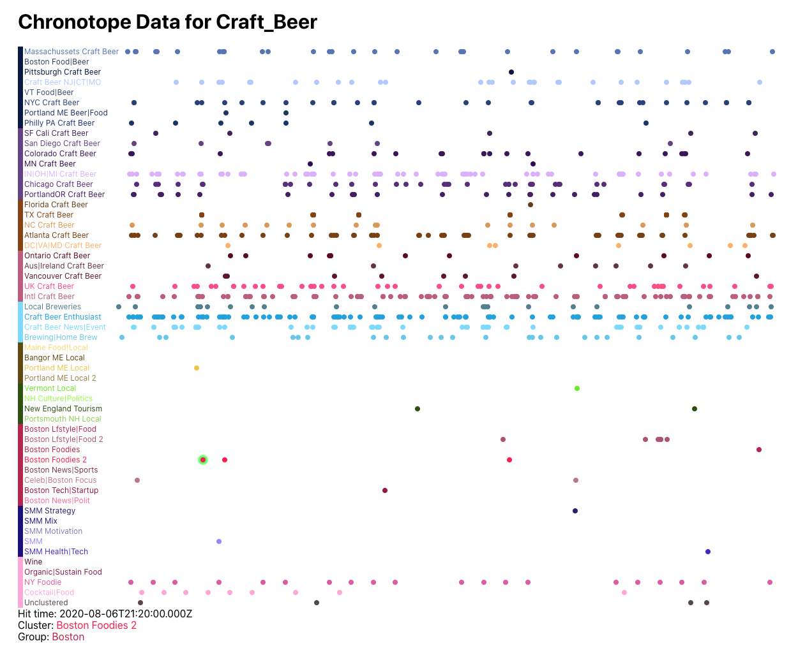

# Full Stack Engineer Take-Home Project

The goal of this exercise is to test your front-end chops and validate your ability to write a React component that interacts with a miniature version of our real-world API, and renders a visualization that is used by our application today. A later review of this project will expand on the work you've done and test your ability in designing the API and the data store itself.

This repository contains a barebones application that was scaffolded by Create React App.

> ⚠️ You will need Node and NPM installed to do this project!

To start the project, run the following :

```sh
# Install app dependencies
npm install
# Run the app on port 3000
npm start
```

To verify that everything worked, you should see a page with the words "Hello from Graphika!" on it.

The goal of this application is to display chronotope information for a map in a single page: a chronotope is a scatter-plot-like visualization that displays the usages of a specific hashtag over time by nodes within specific segments or groups of a map. You are given artistic freedom in whatever styling or markup you use as long as it's sensible given consideration the scale and format of the data.

## API

There are four API endpoints mocked up for you, which roughly corresponds to the information architecture and hierarchy within the Graphika platform:

- `fetchMap()` returns the metadata for a single map. A chronotope page is always within the context of a single map. A map contains groups, which in turn contain segments.
- `fetchGroups()` returns the metadata for all of the groups of segments for a map. Groups are ordered by their `position` property and are unique identified within a map via their `group_no` property.
- `fetchSegments()` returns the metadata for all of the segments for a map. Each segment is a collection of Twitter users. The segment object has a pointer `group_no` that that tells you which group it's in (it matches to a group's corresponding `group_no` property). Segments are ordered by their `position` property and are uniquely identified within a map via their `segment_no` property.
- `fetchChronotopeData()` returns an array of occurrences for the hashtag `#craftbeer` in this map. Each one will have a `hit_time` that tells you when (in UTC) the hashtag was used, and the `segment_no` which tells you in which segment the user of this hashtag belongs in (it matches to a segment's corresponding `segment_no` property).

## Requirements

The business requirements for this exercise is to have the React application render the chronotope visualization with the following must-haves:

- There should be a title on the page that contains the map's name
- There should be a visualization with two axes:
  - The x-axis is time, starting from the earliest occurrence in the chronotope data, and ending with the latest occurrence in the chronotope data
  - The y-axis has a categorical entry for each segment, depending on the grouping mode.
  - The y-axis values should be ordinally sorted by the following criterion: by the group's `position` ascending, then by the segment's `position` ascending. Example: if two values corresponding to segments A and B have positions 12 and 3, but A's group has position 2 and B's group has position 4, then A should come before B. If A and B belongs in the same group, then A should come after B.
- You do not need to render the axes or their labels, but the visualization must render a data point corresponding to the appropriate X and Y coordinate based on when an occurrence happened (x-value) and in which segment the occurrence happened (y-value). One data point should be rendered per occurrence.
- Each data point rendered on the page should have the same color as the segment that it belongs to. The color of a segment is dictated by its `hex_color` property (which is a hex value).
- When clicking on a data point, there should be an informational block appearing somewhere on the page (it can be a tooltip, or it can just be rendered beneath the visualization) that lists the details of the occurrence:
  - When the occurrence happened
  - The name of the segment in which it happened, this text should be colored by the segment's `hex_color`.
  - The name of the group in which it happened, this text should be colored by the group's `hex_color`.
- You are free to write tests for this project but they are _not_ necessary. CRA equips this repository with a Jest test runner.

## Delivery

Once you are complete with the project, remove your `node_modules` folder, and zip up the entire solution with its source files and send it back to us. Note that delivering via email will sometimes fail due to email clients blocking JavaScript files from being sent (even if they are zipped up). In those cases, you can upload it to a Google Drive or Dropbox (or any storage hosting solution of your choice) and send us a public link to download it with your response email.

## Example

An example of a finished project can be found in `chronotope_example.png`.

The example additionally renders segment labels on the y-axis along with the colors of the groups that they belong to to emphasize the necessary ordering of the y-axis values. You are not required to render the labels themselves, but the ordering criterion must be satisfied.

The example also renders what needs to be displayed when a data point is clicked. In this one, the left-most data point is highlighted inside the "Boston Foodies 2" segment, and the "tooltip" is displayed on the lower left-hand corner.



## Restrictions

- You should only spend a max of 2 hours working on this.
- You may not modify any code within `src/api`, or `src/index.js`.
- You are free to modify existing or create any new (S)CSS files for styling purposes.
